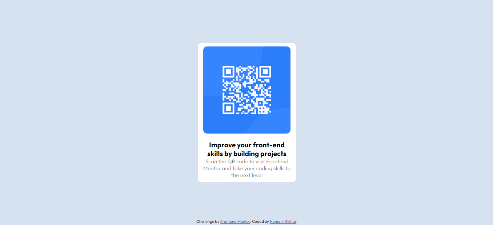

# Frontend Mentor - QR code component solution

This is a solution to the [QR code component challenge on Frontend Mentor](https://www.frontendmentor.io/challenges/qr-code-component-iux_sIO_H). Frontend Mentor challenges help you improve your coding skills by building realistic projects. 

## Table of contents

- [Overview](#overview)
  - [Screenshot](#screenshot)
  - [Links](#links)
- [My process](#my-process)
  - [Built with](#built-with)
  - [What I learned](#what-i-learned)
  - [Continued development](#continued-development)
- [Author](#author)

## Overview
  This is my very first [Front-End Mentor](https://www.frontendmentor.io) challenge
  
### Screenshot



### Links

- [Solution URL](https://github.com/numan-iftikhar/QR-code-FEM/)
- [Live Site URL](https://numan-iftikhar.github.io/QR-code-FEM/)

## My process

* I started with the HTML
* Styled with CSS
* Struggled a bit to center div.container 😁
* But I was missing height: 100vh;
* Lastly, updated the README.md

### Built with

- Semantic HTML5 markup
- CSS custom properties
- CSS Grid
- Mobile-first workflow

### What I learned

I learned how to make a QR card and center div.container

```html
<body>
  <div class="container">
    card content...
  </div>
</body>
```
```css
body{
  height: 100vh;
  display: grid;
  place-items: center;
}
```


### Continued development

From now on, I'll be focussing on CSS Grid

## Author

- Frontend Mentor - [@numan-iftikhar](https://www.frontendmentor.io/profile/numan-iftikhar)
- Twitter - [@numan_iftikhar7](https://www.twitter.com/numan_iftikhar7)
